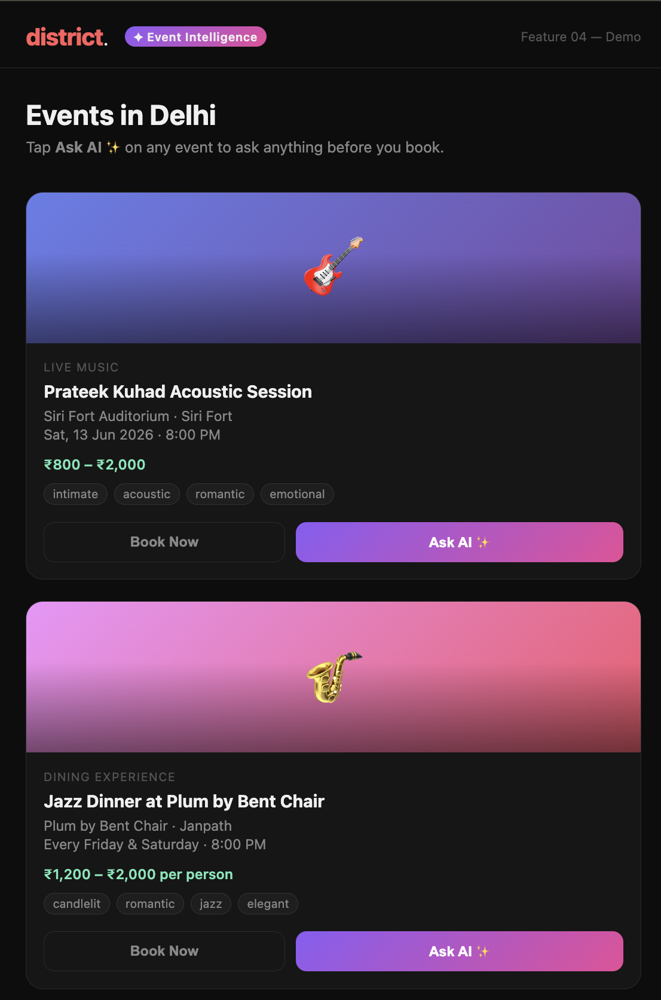
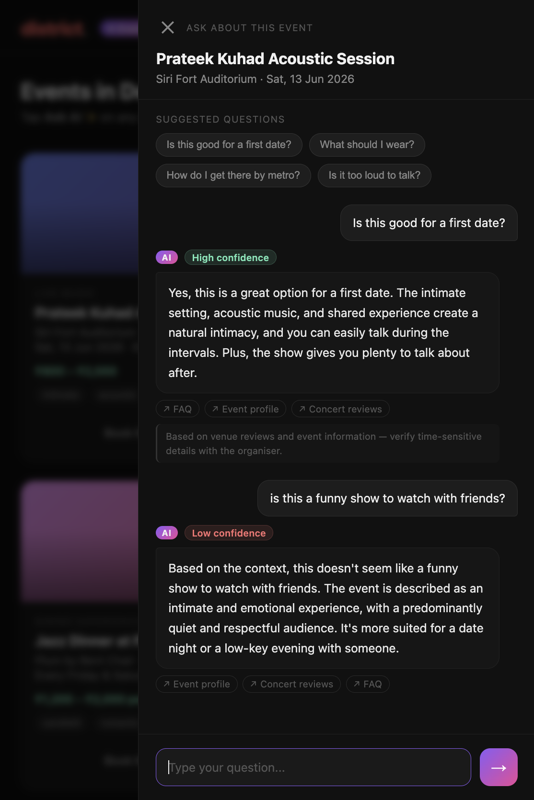

# Deets

Get the deets on any event before you book. Ask anything — dress code, first date vibes, metro route, whether the artist actually goes hard live.

> "Is this good for a first date?", "What should I wear?", "How do I get there?" — answered from real venue reviews and event info, not made up.

<table>
<tr>
<td align="center"><b>Event grid</b></td>
<td align="center"><b>Ask AI panel</b></td>
</tr>
<tr>
<td></td>
<td></td>
</tr>
<tr>
<td align="center"><i>Events with vibe tags and "Ask AI ✨" button</i></td>
<td align="center"><i>Grounded Q&A from venue reviews and event info</i></td>
</tr>
</table>

---

## The Problem

Open any event on District. You'll see a title, a date, and a price. What you won't see:

- Is this good for a first date?
- What should I wear?
- Is it too loud to talk?
- How early do I need to arrive for a good spot?
- Is the artist actually good live?
- Is there parking?

Every unanswered question is a reason not to book. Users go to Google, get distracted, and don't come back.

---

## How It Works

Each event gets its own mini knowledge base — chunks of text from venue reviews, artist bios, and event info, embedded into Qdrant. When a user asks a question, the relevant chunks are retrieved and used to ground the LLM answer.

```
"Ask AI" tap → user types question
      ↓
Embed question (all-MiniLM-L6-v2)
      ↓
Qdrant vector search — filtered to this event only
  → retrieve top 4 relevant chunks
      ↓
Groq (Llama 3.1 8B) generates answer from retrieved context
  → Answer ONLY from context — no hallucination
  → "I don't know" if context doesn't cover the question
      ↓
Response: answer + confidence + sources + caveat
```

### Knowledge Base Structure

Each event has 5–6 knowledge chunks by type:

| Chunk type | What it contains |
|---|---|
| `venue_review` | Capacity, acoustics, seating, toilets, parking, atmosphere |
| `artist_bio` | Who they are, what they're known for, setlist expectations |
| `artist_review` | What the live show is actually like |
| `practical_info` | Entry times, metro routes, parking, security, dress code |
| `vibe_description` | Who attends, energy level, date-night suitability |
| `faq` | Pre-written answers to the 5–6 most common questions |

### Q&A Example

```
User: "Is this good for a first date?"

Retrieved chunks: vibe_description, artist_review, faq

Answer: "Yes — this is one of Delhi's best first date options. The venue is
intimate with candlelit tables, the music is at a conversational volume,
and most attendees are couples. Dress smart casual."

Confidence: high (cosine similarity > 0.55)
Sources: Event profile, Concert reviews
```

---

## Stack

| Component | Technology |
|---|---|
| Knowledge base | Qdrant in-memory (no Docker needed) |
| Embeddings | `all-MiniLM-L6-v2` via sentence-transformers |
| Q&A LLM | Groq API — Llama 3.1 8B Instant |
| API | FastAPI |
| Frontend | Vanilla JS served at `/` |

Qdrant runs in-memory — seeded fresh at startup from `data/events.py`. No infrastructure required beyond Python and a Groq key.

---

## Setup

**Requirements:** Python 3.11+, a Groq API key (free tier works).

```bash
# 1. Clone and set up env
cp .env.example .env
# Add your GROQ_API_KEY to .env

# 2. Install dependencies
python -m venv venv && source venv/bin/activate
pip install -r requirements.txt

# 3. Run the API
uvicorn api.main:app --reload --port 8001
```

Open `http://localhost:8001` — the event grid loads automatically. Click **Ask AI ✨** on any event.

---

## Usage

**Event grid:** `http://localhost:8001`

**Ask a question via API:**

```bash
curl -X POST http://localhost:8001/events/eil_001/ask \
  -H "Content-Type: application/json" \
  -d '{"question": "Is this good for a first date?"}'
```

**Response structure:**

```json
{
  "answer": "Yes — this is one of Delhi's best first date options. The venue is intimate with candlelit tables and the music stays at a conversational volume. Most attendees are couples and young professionals.",
  "confidence": "high",
  "sources": [
    { "type": "faq", "label": "FAQ" },
    { "type": "vibe_description", "label": "Event profile" },
    { "type": "artist_review", "label": "Concert reviews" }
  ],
  "caveat": "Based on venue reviews and event information — verify time-sensitive details with the organiser."
}
```

**Demo questions to try per event:**

| Event | Good questions to ask |
|---|---|
| Prateek Kuhad Acoustic | "Is this good for a first date?", "Is it too loud to talk?" |
| Jazz Dinner at Plum | "What should I wear?", "How much will it cost for two?" |
| When Chai Met Toast | "How early should I arrive for a good spot?", "Is parking available?" |
| Peter Cat Recording Co. | "Will I enjoy it as a first-timer?", "What's the age restriction?" |
| Delhi Midnight Cycling | "Is it safe at midnight?", "Do I need to cycle well?" |

**Edge case to demo — shows honest uncertainty:**

```bash
curl -X POST http://localhost:8001/events/eil_003/ask \
  -d '{"question": "Is the sound engineer good?"}'
# Returns: low confidence, "I don't have that information — contact the organiser directly"
```

---

## Project Structure

```
event_intelligence_layer/
├── api/
│   └── main.py              FastAPI app — /events, /events/{id}/ask, /health
├── core/
│   ├── qa.py                Qdrant in-memory KB, embedding, Groq Q&A
│   └── models.py            Pydantic schemas
├── data/
│   └── events.py            5 demo events with knowledge chunks
├── static/
│   └── index.html           Dark-themed event grid + Q&A panel UI
└── .env.example
```

---

## Environment Variables

```bash
GROQ_API_KEY=               # Required. Get free at console.groq.com
GROQ_MODEL=llama-3.1-8b-instant   # Default
```

No other environment variables needed — Qdrant runs in-memory.
