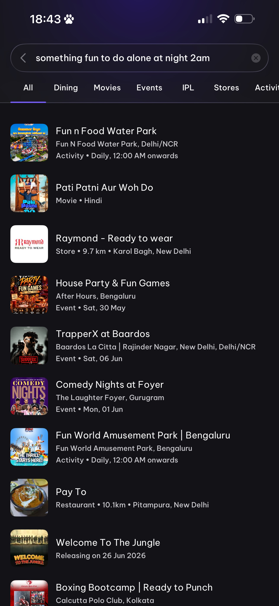
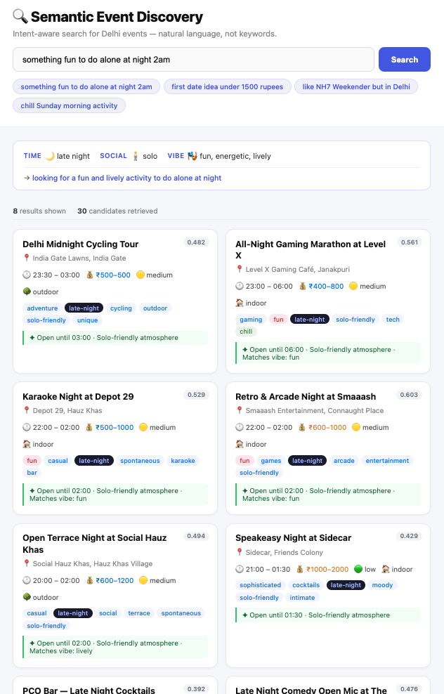
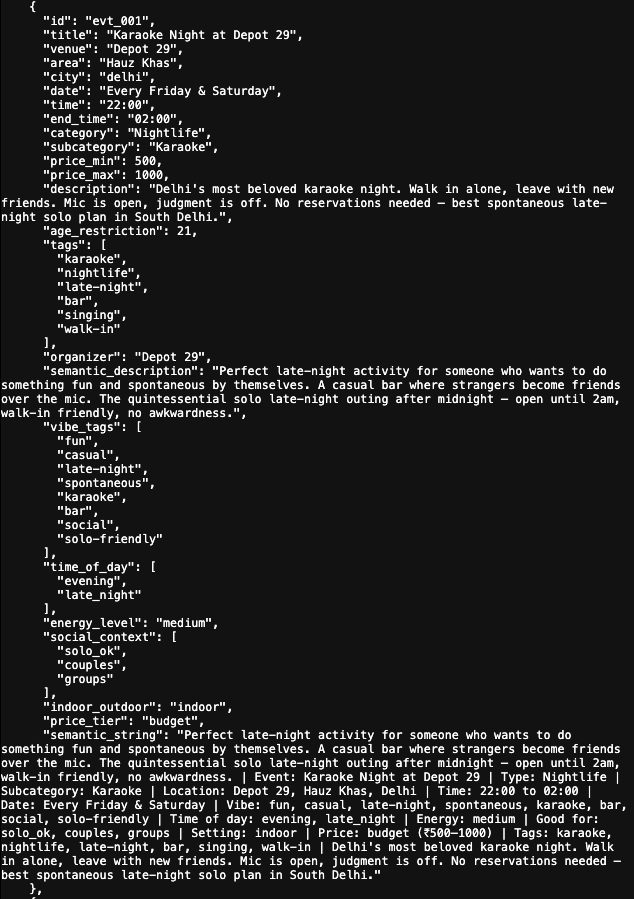

# Mood

Intent-aware search for Delhi events. Tell it your vibe — it finds what you actually mean.

> "something fun to do alone at night 2am" should return late-night solo events, not a water park.

<table>
<tr>
<td align="center"><b>District today — keyword search</b></td>
<td align="center"><b>Semantic Event Discovery</b></td>
</tr>
<tr>
<td></td>
<td></td>
</tr>
<tr>
<td align="center"><i>Query: "something fun to do alone at night 2am"<br/>Returns: water park, clothing store, Bengaluru events</i></td>
<td align="center"><i>Same query → late_night + solo intent parsed<br/>Returns: cycling tour, gaming marathon, karaoke bar</i></td>
</tr>
</table>

---

## The Problem

District's search does keyword matching. Type "something fun to do alone at night 2am" and it returns a water park (closed at night) and clothing stores. It has no understanding of *intent*.

| Query | District Returns | What the User Wants |
|---|---|---|
| `something fun to do alone at night 2am` | Fun n Food Water Park, Raymond | Late-night solo events — karaoke, jazz bars, 24hr cafes |
| `first date idea under 1500 rupees in summer noon` | Irrelevant listings | Romantic spots under ₹1500/person |
| `like NH7 Weekender but in Delhi` | Nothing useful | Indie music festivals, outdoor concerts |
| `chill Sunday early morning activity` | Random | Yoga, brunch spots, morning markets |

---

## How It Works

Three layers replace keyword matching with meaning matching.

```
User Query
    ↓
Intent Parser (Groq / Llama 3.1)
  → extracts: time_of_day, social_context, vibe, price filters
  → rewrites query into a rich semantic string
    ↓
Embedding (all-MiniLM-L6-v2)
  → embeds the rewritten query as a vector
    ↓
Qdrant Vector Search
  → cosine similarity, top-50 candidates
  → optional hard filters: time slot, social context, price
    ↓
Cross-Encoder Re-ranking (ms-marco-MiniLM-L-6-v2)
  → scores original query vs. each candidate
    ↓
Top 10 Results + "why this matches" explanation
```

### Intent Parsing

A fast LLM call (Groq, ~80ms) converts the raw query into structured intent:

```
Input:  "something fun to do alone at night 2am"

Output: {
  time_of_day:   "late_night",
  social_context: "solo",
  vibe:           ["fun", "casual"],
  rewritten_query: "late night solo activity after midnight fun casual indoor Delhi"
}
```

The rewritten query is what gets embedded — it carries the full intent, not just the surface words.

### Event Enrichment

Every event is enriched once (offline, via Groq) into a semantic profile before indexing:

```
{
  vibe_tags:      ["party", "indie", "live", "underground"],
  time_of_day:    ["evening", "late_night"],
  energy_level:   "high",
  social_context: ["solo_ok", "groups", "couples"],
  indoor_outdoor: "indoor",
  price_tier:     "mid",
  semantic_description: "A high-energy live music night with an indie/electronic lineup..."
}
```

This profile — not the raw title — is what gets embedded and searched against.



---

## Stack

| Component | Technology |
|---|---|
| Vector store | Qdrant (Docker) |
| Embeddings | `all-MiniLM-L6-v2` via sentence-transformers |
| Intent parser | Groq API — Llama 3.1 8B |
| Re-ranker | `cross-encoder/ms-marco-MiniLM-L-6-v2` |
| API | FastAPI |
| Enrichment pipeline | Groq async batch |

---

## Setup

**Requirements:** Docker, Python 3.11+, a Groq API key (free tier works).

```bash
# 1. Clone and set up env
cp .env.example .env
# Add your GROQ_API_KEY to .env

# 2. Start Qdrant
docker-compose up -d qdrant

# 3. Install dependencies
python -m venv venv && source venv/bin/activate
pip install -r requirements.txt

# 4. Run the API (auto-seeds demo events on first start)
uvicorn api.main:app --reload
```

The API seeds ~200 Delhi events automatically on first boot if Qdrant is empty.

---

## Usage

**Interactive docs:** `http://localhost:8000/docs`

**Search endpoint:**

```bash
curl -X POST http://localhost:8000/search \
  -H "Content-Type: application/json" \
  -d '{"text": "something fun to do alone at night 2am"}'
```

**Response structure:**

```json
{
  "query": "something fun to do alone at night 2am",
  "intent_parsed": {
    "temporal_context": { "time_of_day": "late_night", "day_type": "any" },
    "social_context": "solo",
    "vibe": ["fun", "casual"],
    "rewritten_query": "late night solo activity after midnight fun casual indoor Delhi"
  },
  "total_candidates": 38,
  "results": [
    {
      "title": "Late Night Karaoke at Gonzo's",
      "venue": "Gonzo's Bar, Hauz Khas",
      "time": "10:00 PM", "end_time": "03:00 AM",
      "price_min": 500, "price_max": 800, "price_tier": "budget",
      "vibe_tags": ["fun", "social", "music", "late-night"],
      "match_reason": "Open until 03:00 AM · Solo-friendly atmosphere · Matches vibe: fun",
      "score": 0.8712
    }
  ]
}
```

---

## Demo Queries

Try these to see intent understanding in action:

```
something fun to do alone at night 2am     → late_night + solo filter
first date idea under 1500 rupees          → couple + price cap at ₹1500
like NH7 Weekender but in Delhi            → indie/festival vibe expansion
chill Sunday morning activity              → morning + low energy filter
plan a surprise birthday for 10 people    → group + evening
```

---

## Run Tests

```bash
# Runs 4 demo queries against live Qdrant and scores intent accuracy + relevant hits
python -m tests.test_queries
```

---

## Project Structure

```
semantic_event_discovery/
├── api/
│   └── main.py              FastAPI app — /search, /events, /health
├── core/
│   ├── intent_parser.py     Groq-powered query → structured intent
│   ├── embedder.py          sentence-transformers embedding + semantic string builder
│   ├── search.py            Qdrant search, filter logic, match reason generation
│   ├── reranker.py          cross-encoder re-ranking
│   └── models.py            Pydantic schemas
├── data/
│   ├── scrape_events.py     raw event data (pre-enriched demo set)
│   ├── enrich_events.py     Groq enrichment pipeline (optional re-run)
│   └── seed_qdrant.py       one-shot seeder
├── tests/
│   └── test_queries.py      4-query demo test suite
├── docker-compose.yml       Qdrant + Redis + API
└── .env.example
```

---

## Environment Variables

```bash
GROQ_API_KEY=          # Required for intent parsing. Get free at console.groq.com
GROQ_MODEL=llama-3.1-8b-instant   # Default
QDRANT_HOST=localhost  # or "qdrant" when running via docker-compose
QDRANT_PORT=6333
COLLECTION_NAME=district_events
EMBEDDING_MODEL=all-MiniLM-L6-v2
```

Without `GROQ_API_KEY`, the system falls back to a rule-based intent parser (regex on keywords). Search still works — it's just less accurate on ambiguous queries.
